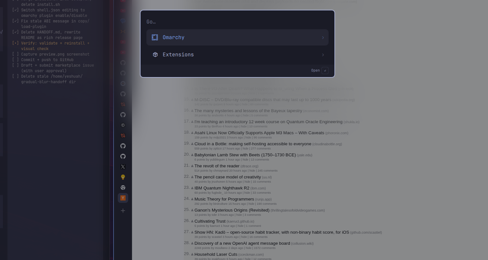
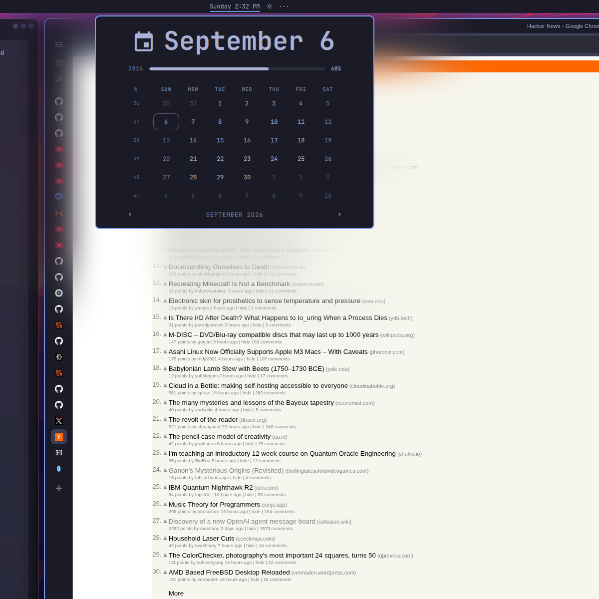

<div align="center">

# Aura Blur

**A continuous, high-quality gradual blur that surrounds Omarchy popups,
panels, notifications, and OSDs.**

Blur is strongest at the real rounded edge of every surface and fades
smoothly away in every direction — like a halo of frosted light.



*The Omarchy launcher with its blur halo over Hacker News.*



*The bar clock's calendar popup — strongest at the panel edge, fading
smoothly until the page underneath is fully sharp.*

[](LICENSE)
[](https://hyprland.org)
[](https://omarchy.org)
[]()

[Features](#features) · [Install](#install) · [Update](#update) ·
[Remove](#remove) · [Troubleshooting](#troubleshooting) ·
[How it works](#how-it-works)

</div>

---

## Features

- **True gradual falloff** — one continuous two-axis matte computed from each
  surface's real rounded edge. No rings, no banding, no stepped halos.
- **Live, not faked** — blurs Hyprland's live compositor framebuffer through
  the native three-pass blur pipeline. No screenshots, no cached desktop
  images, no rasterization.
- **The right things stay sharp** — application content is blurred before
  Omarchy renders its menu bar, popup contents, and overlay surfaces, so the
  bar, popup text, and the screenshot selector are never degraded.
- **ABI-guarded** — a stamp tied to the exact running Hyprland commit refuses
  to load a stale build and notifies you instead of risking a compositor
  crash.
- **Clean by design** — creates no Wayland surface, accepts no pointer or
  keyboard input, never uses `sudo`, and never touches `/usr/share/omarchy`.

## Requirements

- Omarchy Quattro with Hyprland and the Omarchy shell
- `hyprland`, `quickshell`, `cmake`, `ninja`, `gcc`, `pkgconf`, and `json-c`
  (`quickshell` already provides the Qt6 runtime and development files)
- Hyprland development headers matching the running compositor

Aura Blur includes an ABI-sensitive Hyprland plugin, so setup compiles it
locally against your installed headers. No prebuilt compositor binary is
downloaded or executed.

## Install

Add the plugin, then run its reviewed setup script:

```sh
omarchy plugin add https://github.com/Sh3nron/omarchy-aura-blur.git
~/.config/omarchy/plugins/io.github.sh3nron.aura-blur/setup.sh
```

Setup builds both native components, creates timestamped backups, installs
user-owned files under `~/.config`, enables the service, reloads Hyprland,
and restarts the Omarchy shell.

## Update

Hyprland plugins are tied to the exact compositor ABI. Rebuild after every
Aura Blur or Hyprland update:

```sh
omarchy plugin update io.github.sh3nron.aura-blur
~/.config/omarchy/plugins/io.github.sh3nron.aura-blur/setup.sh
```

## Remove

Clean up the runtime before deleting the checkout:

```sh
~/.config/omarchy/plugins/io.github.sh3nron.aura-blur/uninstall.sh
omarchy plugin remove io.github.sh3nron.aura-blur
```

Uninstall unloads the compositor plugin, removes only Aura Blur's runtime
and Hyprland configuration entries, reloads the desktop, and preserves a
timestamped backup.

Backups live under `~/.local/state/aura-blur/`.

## Troubleshooting

**"Aura Blur disabled — Hyprland changed"**
The compositor was updated and the plugin ABI no longer matches. Run the
[update](#update) commands to rebuild; the guard intentionally blocks loading
an outdated binary.

**v1.0.x prone to silently staying disabled after an update (fixed in 1.0.2)**
Older builds linked Hyprland's dependency tree, so the `.so` carried hard
`NEEDED` sonames (e.g. `libaquamarine.so.13`) that broke whenever a
dependency package updated — and `hyprctl plugin load` exits 0 even on
failure, so the loader reported success while the plugin stayed unloaded.
v1.0.2 rebuilds with the correct linking model (compositor symbols resolved
at load time; only stable external libs — e.g. json-c — are linked) and the
loader now verifies via `hyprctl plugin list -j`. Run the update commands.

**Blur appears on something it shouldn't (or is missing)**
The observer's namespace filter is user-editable at
`~/.config/hypr/gradual-blur/config.jsonc`. Add or remove entries under
`exclude_namespaces`, then run `omarchy restart shell`.

**Adjusting blur quality**
The quality profile lives at `~/.config/hypr/gradual-blur.lua`. It ships
tuned (`size = 6`, `passes = 3`, `noise = 0`) for the cleanest falloff;
changing it changes the look of the effect everywhere.

## How it works

A native Qt/Quickshell observer watches Omarchy's shell surfaces and reports
exact live popup geometry — rectangles, corner radii, output names, and
opacity — over a local Unix socket. At Hyprland's `RENDER_POST_WINDOWS`
stage, a custom render-pass plugin:

1. blurs the live compositor framebuffer with Hyprland's native three-pass
   blur;
2. computes one smooth two-axis falloff from each real rounded card edge;
3. composites the blurred texture through that matte; and
4. lets Hyprland render Top and Overlay layers afterward, so the menu bar,
   popup content, and screenshot UI stay pixel-sharp on top.

The matte is quarter-resolution scalar opacity with linear GPU sampling, and
deliberately underlaps each card slightly so antialiased edges never reveal
an unblurred seam. The plugin also declares its live-blur needs to Hyprland
so partial redraws repaint underlying application pixels before they are
sampled — preventing wallpaper colors from leaking into blurred regions.

## License

[MIT](LICENSE)
